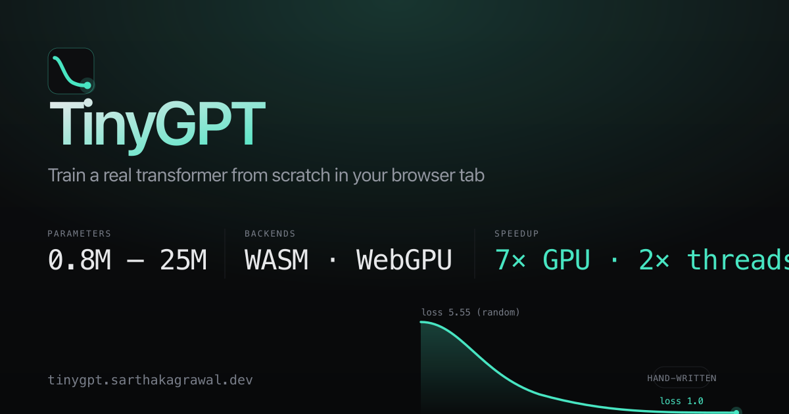

# posttrainllm

A **Mac-first LLM factory + runtime + research substrate** — and the
browser playground that started the project. MIT-licensed, runs
entirely locally, zero cloud.

The strongest measured claim: a **4B model distilled locally from ~99
frontier rollouts on one Mac matches DeepSeek-V4-pro at 100% on a
multi-turn agentic tool-calling gate** that Gemma-12B-qat scores 75%
on. The full writeup, methodology, and head-to-head table is
[`docs/learn/tool-calling-frontier-parity.md`](docs/learn/tool-calling-frontier-parity.md).

**[Live browser playground →](https://posttrainllm.com)**
· [Mac CLI quickstart](#quickstart-mac)
· [Current factory plan](docs/NEXT.md)
· [Frontier-parity result](docs/learn/tool-calling-frontier-parity.md)



---

## What's actually in here

| Surface | What it does | Where to look |
|---|---|---|
| **Factory CLI** (`posttrainllm`) | Data prep · post-training · eval gates · traces · packaging · serve/agent/runtime utilities. MLX-Swift on Apple Silicon. | [`native-mac/`](native-mac/), [`docs/NEXT.md`](docs/NEXT.md) |
| **Factory docs** | Active sequence, run schema, eval protocol, packaging, and report shape. | [`docs/factory/`](docs/factory/) |
| **Mac app** (SwiftUI) | GUI shell over the CLI. Parked except for a future minimal Factory Run Center. | [`native-mac/Sources/TinyGPTApp/`](native-mac/Sources/TinyGPTApp/), [`docs/parked/app-polish.md`](docs/parked/app-polish.md) |
| **Eval moat** | E0 shared schema · BFCL · τ-bench · lm-eval (MLX-routed) · HumanEval (sandbox-exec) · eval-gate (CI). | [`docs/leaderboard.md`](docs/leaderboard.md), [`docs/research/mac_slm_leaderboard_v0.md`](docs/research/mac_slm_leaderboard_v0.md) |
| **Agent runtime** | OpenAI + Ollama-compatible local serve · multi-turn loop · FSM-constrained JSON · cloud-escalate · token-preserving `.atraj` trajectories. | [`docs/agent_runtime.md`](docs/agent_runtime.md) |
| **Interp** | SAE (per-layer + group) · SAELens export · MEMIT · ROME · tuned/logit lens · activation patching. | [`docs/interpretability.md`](docs/interpretability.md) |
| **Trained specialists** | From-scratch classifiers + distilled/fused LLMs. Pace intent router (49.5M, 95.5%, 3ms) · file-ops distilled (4B, 100% hard gate) · ReST fused (4B, 65% OOD). | [`specialists/`](specialists/), [`specialists/registry.json`](specialists/registry.json) |
| **Browser playground** | The original surface: GPT-2 trained from scratch in a browser tab via hand-written WebGPU. Parked for active factory work. | [`browser/`](browser/), [live](https://posttrainllm.com), [`docs/parked/browser.md`](docs/parked/browser.md) |
| **ANE M8** | Layer-chunked Core ML chain running Qwen3-28-block on the Apple Neural Engine at ~17 tok/s. Parked until a shipped specialist needs runtime optimization. | [`docs/parked/ane-coreml.md`](docs/parked/ane-coreml.md) |

---

## Quickstart (Mac)

```bash
git clone https://github.com/sarthakagrawal927/posttrainllm && cd posttrainllm/native-mac

# One-time: Metal toolchain (Xcode 27+).
xcodebuild -downloadComponent MetalToolchain

# Build
DEVELOPER_DIR=/Applications/Xcode.app/Contents/Developer \
  xcrun swift build -c release
BIN=.build/release/posttrainllm

# Try the CLI
$BIN --help

# Train a tiny model from scratch on the bundled corpus (~2 min)
$BIN train --preset tiny --steps 200 \
  --corpus ../data/examples/tiny-corpus.txt --out /tmp/tiny.tinygpt

# Sample from it
$BIN sample /tmp/tiny.tinygpt --prompt "ROMEO:" --max-tokens 100

# Or LoRA-fine-tune a HuggingFace model on your data
$BIN sft <hf-model-dir-or-id> \
  --data your-corpus.jsonl --out my-adapter.tgla

# Export a distilled model or adapter for Python MLX / MLX-Swift
$BIN export-mlx /tmp/tiny.tinygpt --out /tmp/tiny-mlx
$BIN export-mlx my-adapter.tgla --out ./my-adapter-mlx

# Serve any posttrainllm or HF model on an OpenAI-compatible endpoint
$BIN serve <model> --port 8090
curl http://localhost:8090/v1/chat/completions \
  -H "Content-Type: application/json" \
  -d '{"model":"posttrainllm","messages":[{"role":"user","content":"hi"}]}'
```

**Mac app** — same project, SwiftUI frontend:

```bash
DEVELOPER_DIR=/Applications/Xcode.app/Contents/Developer \
  xcrun swift build --product TinyGPTApp
.build/debug/TinyGPTApp
```

---

## Quickstart (browser playground)

Open **[posttrainllm.com](https://posttrainllm.com)**.

- *Load pretrained model* — Shakespeare checkpoint, generate immediately.
- *Train your own from scratch* — ~15 min on the larger presets,
  WebGPU on Chrome/Edge 113+ and Safari 18+.

To build it locally:

```bash
bash wasm/build_wasm.sh          # needs Emscripten SDK
cd browser && npm install && npm run dev
```

---

## Headline measured numbers

All on a single Apple M-series laptop (primary: M5 Pro / 48 GB). No
multi-GPU, no cloud, no asterisk.

| What | Number | Source |
|---|---|---|
| **Multi-turn agentic hard gate, 4B distilled** | **100%** (vs DeepSeek-V4-pro 100%, Gemma-12B-qat 75%, stock 4B+plan 33%) | [`docs/learn/tool-calling-frontier-parity.md`](docs/learn/tool-calling-frontier-parity.md) §8.1 |
| Distillation budget | ~99 frontier rollouts · LoRA SFT · 16 layers · lr 1e-5 · 4 epochs | same |
| Decode throughput, Huge preset (96M, ctx 1024) | **696 tok/s** sustained | [`docs/PLAN.md`](docs/PLAN.md) headline metrics |
| Decode, Mega preset (960M, ctx 1024) | **293 tok/s** | same |
| First-token latency (TTFT) | **5.8 ms p99** | same |
| Training step (Huge, B=8) | **42 ms/step** | same |
| ANE chain (Qwen3 28-block, layer-chunked Core ML) | **17 tok/s** | [`docs/PLAN.md`](docs/PLAN.md) §1 |
| Browser WebGPU end-to-end vs WASM SIMD | **2.6× → 12.1×** (curve grows with `d_model` 96 → 256) | [`docs/performance.md`](docs/performance.md) |
| Largest browser-trainable model | **960M params** via Memory64 | [`browser/devlog.html`](browser/devlog.html) |
| Loss drift, WebGPU vs WASM reference | **1.1% – 2.5%** across the curve | `tests/test_webgpu_train.mjs` |
| First end-to-end Mac LoRA fine-tune | **−32% held-out PPL**, 788 KB adapter | [`WHILE_YOU_SLEPT.md`](WHILE_YOU_SLEPT.md) |
| **Pace intent router, 49.5M from-scratch** | **95.5% accuracy** vs Apple FM 76.5% (+19 pp) vs Qwen3-4B 84.75% (+10.8 pp), **3ms** vs 1597ms vs 240ms, 7-class routing | [`specialists/pace-intent-router-v8/model_card.md`](specialists/pace-intent-router-v8/model_card.md) |

---

## Honest scope

**What this is:**

- A single-developer project that ships in public, MIT-licensed.
- Mac-first (Apple Silicon, MLX-Swift). The Linux/CUDA path is not
  built. Browser path stays first-class.
- A factory: target → data → post-training → eval → package → report.

**What this isn't (yet):**

- An enterprise platform. There's no auth, no SSO, no team workspace,
  no SLA. Solo project.
- A frontier-model trainer. Specialists distilled from frontier
  teachers; the floor is wherever the teacher set it.
- A general-purpose agent platform (Vercel Eve / Cursor / Replit
  Agent). Different shape — these run on your hardware on a model
  you trained, not on someone's cloud on someone's model.

**Known limits, named:**

- Specialist track learned a depth tax: out-of-domain breadth
  regressed 60% → 42% on the catastrophic-forgetting gate during the
  v11 → v12 transition. We measure it instead of papering over it.
  See [`docs/learn/tool-calling-frontier-parity.md`](docs/learn/tool-calling-frontier-parity.md) §8.4.
- The Apple on-device foundation model (4096-token ctx) can't ground
  actions — verdict: free routing floor, never a dependency.
  [`docs/learn/apple-on-device-foundation-models.md`](docs/learn/apple-on-device-foundation-models.md).
- Multi-GPU / distributed: a single-Mac data-parallel mlx.distributed
  PoC exists ([`scripts/archive/dist_dp_poc.py`](scripts/archive/dist_dp_poc.py));
  multi-Mac is unblocked but unproven.

---

## Repo layout

```
posttrainllm/
  native-mac/      MLX-Swift CLI + SwiftUI app — the main surface
  browser/         The original WebGPU playground (Astro + WGSL + WASM)
  webgpu/          Hand-written WGSL kernels (forward, backward, AdamW, FA2)
  wasm/            C++ kernels + reference C++ model → WebAssembly
  python_ref/      PyTorch reference: model, train, sample, LoRA, bench
  evals/           Smoke tests + eval fixtures (BFCL, MATH-500, etc.)
  scripts/         BFCL drivers, mlx.distributed PoC, leaderboard builders
  docs/            Plan + recipes + research + sessions + per-topic guides
  configs/         Model / training / LoRA / PEFT settings as JSON
  data/            Dataset builder + example corpora
  tests/           Correctness tests — finite-diff, overfit, parity
```

---

## Docs (curated)

Start here:

- [`PROJECT_STATUS.md`](PROJECT_STATUS.md) — current state and active scope.
- [`docs/NEXT.md`](docs/NEXT.md) — the active factory sequence.
- [`docs/factory/`](docs/factory/) — run schema, eval protocol, packaging,
  and report templates.
- [`docs/parked/`](docs/parked/) — paused lanes that should not compete with
  the current factory proof.
- [`docs/learn/tool-calling-frontier-parity.md`](docs/learn/tool-calling-frontier-parity.md)
  — the strongest measured result, head-to-head methodology.
- [`docs/agent_runtime.md`](docs/agent_runtime.md) — the agent
  runtime including the B22 token-preserving trajectory format.
- [`docs/recipes/from-traces.md`](docs/recipes/from-traces.md) —
  closed loop: `.atraj` rollouts → SFT JSONL → trained specialist.
- [`docs/research/mac_slm_leaderboard_v0.md`](docs/research/mac_slm_leaderboard_v0.md)
  — the Mac SLM leaderboard.
- [`native-mac/ARCHITECTURE.md`](native-mac/ARCHITECTURE.md) —
  top-down tour of the Mac codebase.
- [`docs/PLAN.md`](docs/PLAN.md) — long historical ledger. Useful, but not the
  active queue.

Deeper:

- [`docs/performance.md`](docs/performance.md), [`docs/archive/lessons.md`](docs/archive/lessons.md),
  [`docs/training/index.md`](docs/training/index.md),
  [`docs/distillation.md`](docs/distillation.md),
  [`docs/interpretability.md`](docs/interpretability.md),
  [`docs/determinism.md`](docs/determinism.md),
  [`docs/CITATIONS.md`](docs/CITATIONS.md).

Sessions + research:

- [`docs/sessions/`](docs/sessions/) — chronological retrospectives.
- [`docs/research/`](docs/research/) — written-up investigations.
- [`docs/learn/`](docs/learn/) — primers + the project's learning map.

---

## License

MIT — see [`LICENSE`](LICENSE).

Author: **Sarthak Agrawal** ([@sarthakagrawal927](https://github.com/sarthakagrawal927)).

If posttrainllm is useful to your work or you want to chat about
Mac-first ML training: open an issue, or reach out on
[LinkedIn](https://www.linkedin.com/in/sarthakagrawal927/) /
[Twitter](https://twitter.com/sarthakcodes).
