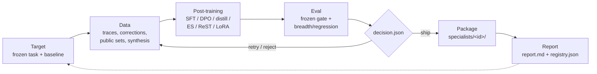

# How it works: the specialist factory end-to-end

This is the orientation page for someone learning the system. Read it first,
then follow the links into the deeper docs. It explains **what the pieces are,
how data and control flow through the loop, and why the major design decisions
were made** — grounded in the actual code and the committed docs, not aspiration.

For the authoritative state (what has actually shipped vs parked), see
[`PROJECT_STATUS.md`](https://github.com/PostTrainLLM/posttrainllm/blob/main/PROJECT_STATUS.md).
For the ground-up curriculum, see [`/learn/curriculum`](../learn/curriculum.md).

## What the system is

posttrainllm is a **Mac-local specialist factory**. Its one product loop is:

```text
target -> data -> post-training -> eval -> package -> report
```

Everything else in the repo — the browser playground, the Python reference, the
WASM/WebGPU training path, the native Swift/MLX runtime, the eval harnesses —
is an **asset for that loop, not a separate product** (see
[`PROJECT_STATUS.md` Why/What](https://github.com/PostTrainLLM/posttrainllm/blob/main/PROJECT_STATUS.md)).
The canonical definition of the loop and what counts as proof lives in
[`/factory/overview`](../factory/overview.md); this page won't restate it.

## The factory loop



Each stage has a required proof, defined in
[`/factory/post-training-factory`](../factory/post-training-factory.md) (the
pillar table) and enforced by the run contract in
[`/factory/run-schema`](../factory/run-schema.md). A run only counts if it has a
frozen target, a frozen baseline, a dataset manifest, a train config, a
before/after eval, a packaged artifact **or** explicit rejection, and a report.

### 1. Target

A target is a **frozen task plus a frozen baseline** — e.g. `pace-planner`,
`qwen06-sql-hygiene`, `qwen3-4b-file-ops`. Freezing both first is what stops the
loop from training against a moving eval (the first rule in
[`/factory/eval-protocol`](../factory/eval-protocol.md)).

### 2. Data

Data primitives turn raw signal into a manifest with provenance and a held-out
split: `traces-to-data`, `corrections-to-data`, `quality-filter`,
`reasoning-classify`, `dedupe`, `download-dataset`, `extractor-data`, plus
`synthesize` for synthetic examples. These are CLI subcommands dispatched in
`native-mac/Sources/TinyGPT/TinyGPT.swift`. Provenance and dataset shape are
tracked in [`/data_inventory`](../data_inventory.md).

### 3. Post-training

The post-training primitives are also CLI subcommands: `sft`, `dpo`, `distill`,
`es` (evolution strategies), `finetune` (LoRA), `merge`, `bake-lora`. The actual
training math lives in `native-mac/Sources/TinyGPTModel/`:

- `Trainer.swift` — the AdamW + compiled train step (`valueAndGrad(loss)` →
  `optimizer.update`), shared by full training and LoRA fine-tuning.
- `Lora.swift` / `LoraIO.swift` / `LoraComposition.swift` — the low-rank adapter
  `Linear` subclass (`y = base(x) + (x @ A) @ B * scale`), its `.lora` file
  format, and multi-adapter stacking. LoRA injection replaces `q_proj`/`v_proj`,
  freezes the base, and shrinks trainable params dramatically (the worked
  example in [`native-mac/ARCHITECTURE.md`](https://github.com/PostTrainLLM/posttrainllm/blob/main/native-mac/ARCHITECTURE.md)
  goes 9.6M → 98K), so gradients only flow into `A`, `B`.

The runtime that runs these is described next in [Runtime](#the-native-mac-runtime).

### 4. Eval

Eval keeps the **primary task score and the regression/breadth score separate**
(rule 3 of [`/factory/eval-protocol`](../factory/eval-protocol.md)) — a
specialist that aces its gate but craters out-of-domain is not a general model.
Harnesses are, again, CLI subcommands: `eval-gate`, `eval-compare`, `eval-bfcl`,
`eval-tau-bench`, `run-lm-eval`, `eval-sql`, `eval-router`, `eval-escalate`,
plus the Indic `eval-indic`. General model sanity runs through `serve` (see
below). No-GPU smokes and fixtures under `evals/` are the cheap first check.

### 5 & 6. Package and report

The eval writes a `decision.json`. A specialist package is created **only when
that decision says `ship`** ([`/factory/packaging`](../factory/packaging.md)).
A package is a small, inspectable folder under `specialists/<id>/`:
`model_card.md`, `eval_report.json`, `tinygpt.lock.json`, `prompt.md`,
`report.md`. The large weights or adapter live in a cache/HF, not in git. The
package is then recorded in `specialists/registry.json`, which is the registry
of every shipped specialist with its headline numbers and use / do-not-use
lists. Packaging and reporting shape are in
[`/factory/packaging`](../factory/packaging.md) and
[`/factory/reports`](../factory/reports.md).

The full loop has run end-to-end with both outcomes: `qwen06-sql-hygiene-dpo-v1`
ended in a **retry** decision, while `qwen3-4b-rest-fused` reached a narrow
**ship** — see [`PROJECT_STATUS.md`](https://github.com/PostTrainLLM/posttrainllm/blob/main/PROJECT_STATUS.md).

## The native-mac runtime

The factory's main surface is the native Swift + MLX CLI under
`native-mac/Sources/`. The full module tour is in
[`native-mac/ARCHITECTURE.md`](https://github.com/PostTrainLLM/posttrainllm/blob/main/native-mac/ARCHITECTURE.md);
the load-bearing modules:

| Module | Role |
|---|---|
| `TinyGPTIO` | Pure-Foundation file formats: the `.tinygpt` binary reader/writer, a `SafetensorsReader` for HF weights, and the HF `config.json` parser. No MLX dependency. |
| `TinyGPTModel` | MLX-Swift model + training: `ModelConfig`, `TransformerBlock`, `TinyGPTModel`, `WeightLoader`, `HFWeightMapping` (HF param-name translation), `Tokenizer`, `KVCache`, the LoRA stack, `Trainer`, and the Core ML / ANE inference path (`ANEInference.swift`). |
| `TinyGPT` | The CLI executable. `TinyGPT.swift` is the entry point that dispatches every subcommand (`inspect`, `validate`, `train`, `sft`, `dpo`, `distill`, `eval`, `factory-run`, …). |
| `TinyGPTServe` | An OpenAI-compatible HTTP server (`Serve.swift`) over a loaded model — POSIX sockets, one thread per connection, MLX serialized on a single queue. This lets the canonical `lm-evaluation-harness` grade any model via `local-chat-completions`. Also holds `CloudEscalate.swift`, `PaceFastRouter.swift`, and the grammar-constrained decoding. |
| `TinyGPTApp` | The SwiftUI app shell (train tab, live loss chart, gallery, machine-stats bar) — a readout over the factory, not a separate product. |

Two loading paths meet here: a from-scratch `.tinygpt` checkpoint (fp16) and a
Hugging Face model (safetensors + `config.json`), unified by `WeightLoader` /
`HFWeightMapping`. Inference samples token-by-token through `KVCache`, turning
the O(T²) attention cost into O(T) per step.

### Why native MLX, and why routed specialists

- **Mac-local + MLX.** The whole project is scaled to run on **one Mac**, using
  Apple's MLX-Swift so training and inference use the unified-memory GPU (and,
  on the gated path, the Apple Neural Engine via Core ML). This is the explicit
  framing in [`/factory/post-training-factory`](../factory/post-training-factory.md):
  Baseten's post-training shape, "scaled down to one Mac and public artifacts."
- **Routed specialists, not one general planner.** The measured evidence forces
  this: the file-ops specialist lifts its hard gate from 58% → 100% but
  regresses out-of-domain breadth 59.6% → 42.3%. So it ships as a **routed
  specialist** — used only for file-ops, with the rest of the request space
  handled elsewhere ([`PROJECT_STATUS.md`](https://github.com/PostTrainLLM/posttrainllm/blob/main/PROJECT_STATUS.md)).
  The runtime half of that routing is the small on-device model handling the
  common case and deferring the hard case to a larger cloud model via
  `CloudEscalate.swift` — the north-star "~80% on-device, escalate the rest"
  architecture stated in that file's own header.

### Why Pace must not depend on this repo's dev runtime

For [Pace](../pace-handoff-2026-06-10.md), posttrainllm is a **development-time
factory and eval lab**: it prepares planner data, adapters, specialist packages,
eval fixtures, and reports. But **Pace production must not depend on
`posttrainllm serve`, on localhost, or on this repo's dev runtime**
([`PROJECT_STATUS.md`](https://github.com/PostTrainLLM/posttrainllm/blob/main/PROJECT_STATUS.md)).
The dev serving path is for evaluation and iteration; a shipped artifact is a
package (weights + card + lock) that Pace bundles or loads on its own terms.
This is why deliverables to Pace are *packages and fixtures*, not a running
server (see the [Pace handoff](../pace-handoff-2026-06-10.md)).

## The browser / WASM / WebGPU training path

The repo also carries a **full in-browser training path** under `browser/`,
`wasm/`, and `webgpu/`. It is a **completed learning/perf track, parked** unless
the factory proof needs it ([`PROJECT_STATUS.md`](https://github.com/PostTrainLLM/posttrainllm/blob/main/PROJECT_STATUS.md)
Dependencies table).

It trains transformers client-side using WebGPU compute shaders (`webgpu/*.wgsl`)
with WASM+SIMD fallbacks and OPFS storage. The mental model needed to read those
shaders — device/queue, pipelines, dispatch, workgroups, invocations, bind
groups, and the memory hierarchy — is in
[`/learn/webgpu-execution-model`](../learn/webgpu-execution-model.md), which also
walks the two hot kernels (`matmul_blocked.wgsl`, `attention_fa2.wgsl`). Why it
exists at all: it was how the from-scratch training and numerics were learned and
benchmarked (Phases 7–9 in [`PROJECT_STATUS.md`](https://github.com/PostTrainLLM/posttrainllm/blob/main/PROJECT_STATUS.md)),
and the native MLX `bench-train` subcommand still benchmarks against that WebGPU
baseline. The Python reference under `python_ref/` plays the analogous role for
correctness — a ground-truth path for the from-scratch pieces.

## How it all connects

The three runtimes (native MLX, browser WebGPU, Python reference) implement the
**same transformer + training semantics** at different fidelities: MLX is the
production factory surface, WebGPU/WASM was the learning + perf lab, Python is
the correctness reference. The factory loop is the spine; the CLI subcommands are
its stages; the eval protocol and run schema are its contract; and a `ship`
decision is the only thing that turns a run into a registered specialist package.

## Where to go next

- [`/factory/README`](../factory/README.md) — the factory contract in full.
- [`/factory/run-schema`](../factory/run-schema.md) — the local run directory contract.
- [`/factory/eval-protocol`](../factory/eval-protocol.md) — baseline, regression, ship/reject rules.
- [`/factory/packaging`](../factory/packaging.md) — specialist package layout and lock metadata.
- [`/capability_matrix`](../capability_matrix.md) — what the CLI actually does.
- [`/learn/curriculum`](../learn/curriculum.md) — the ground-up learning path.
- [`native-mac/ARCHITECTURE.md`](https://github.com/PostTrainLLM/posttrainllm/blob/main/native-mac/ARCHITECTURE.md) — module-by-module runtime tour.
