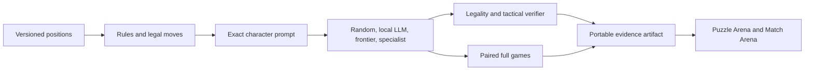

# Design: Chess specialist benchmark

## Decision

Use one character-only policy boundary for two complementary evidence lanes:
tactical positions are the statistical ruler, and complete games are the
demonstration. Neither evaluated language model receives an engine, search,
tool, code, or persistent-memory advantage.



## Policy contract

Every decision receives a single line:

```text
FEN=<six-field FEN>;PLY=<n>;LEGAL=<sorted comma-separated UCI moves>
```

The strict track accepts exactly one legal UCI move. A disclosed constrained
diagnostic may restrict output to the supplied legal set, but never replaces a
strict result. UCI avoids SAN parsing ambiguity and represents promotion in one
token string such as `e7e8q`.

## Correctness oracle

Pin `python-chess` for rules, legal moves, FEN normalization, terminal states,
draw claims, and PGN export. Do not hand-roll chess. Tactical fixtures carry
source/provenance and expected principal-variation moves; an optional pinned
Stockfish executable verifies labels and records centipawn loss, but is never
available to evaluated models.

## Evidence lanes

### Puzzle Arena

The development screen uses a small balanced slice spanning mate, capture,
deflection, fork, pin, promotion, and defensive-only positions. The later
frozen suite uses non-famous held-out positions to reduce memorization risk.
Report top-one move accuracy, legal rate, centipawn loss when available,
latency, throughput, model identity, and cost.

### Match Arena

Run paired games from fixed opening positions, swapping colors. Each match uses
the same strict output parser and records every FEN, legal set, raw output,
parsed move, clock-free ply, terminal result, and trace hash. Report wins,
draws, losses, illegal forfeits, average plies, and paired result uncertainty.
These games support demonstration and regression analysis; puzzle evidence is
the primary admission ruler because it is denser and less opponent-dependent.

## Admission and stopping

The bounded Gate-0 screen compares random legal play, installed 4B and 8–9B
local models, and a pinned frontier model. Training remains blocked unless the
frontier is legal on every strict decision, materially exceeds random on
tactical accuracy, and outperforms the larger local general model. Thresholds
are frozen in config before outputs are inspected. A failed or interrupted
screen is retained and labeled precisely, following Character 2048.

## UI direction

Preserve the existing dark laboratory instrument. The chessboard—not a hero
card—dominates the first viewport. Puzzle Arena scrubs independent decisions;
Match Arena replays complete games with a move list and evaluation evidence.
Teal identifies the live move, coral identifies illegal or losing decisions,
and amber marks incomplete or development-only evidence.

## Explicit non-goals

- No specialist training or synthetic trajectory generation before Gate 0.
- No engine-assisted inference and no claim that the specialist beats a chess
  engine.
- No Elo claim from a development slice.
- No vision model, screenshots, SAN-only parser, timed chess clock, opening
  book, internet search, or hidden conversation state.
