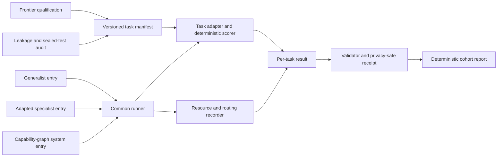

## Context

The repo currently has four adjacent but distinct evidence surfaces:

- `browser` leaderboard tasks rank tiny browser models on deterministic toy or
  perplexity benchmarks;
- factory evals decide whether one candidate beats its baseline without
  unacceptable regression;
- fine-tune report cards publish one candidate's evidence and decision;
- specialist packages describe intended use, prohibited use, and artifact
  identity.

The proposed benchmark is a cohort and system comparison. It must admit
external generalists and routed systems without weakening the repo's
frontier-ceiling, leakage, regression, measurement-state, or privacy rules.

## Goals / Non-Goals

**Goals:**

- Compare different entry types on identical task instances and budgets.
- Make narrow specialization and training access explicit.
- Prefer executable outcomes and final-state verification.
- Treat selective risk and escalation as headline system behavior.
- Include end-to-end resource costs, including routing and cold loading.
- Keep official sealed evaluation reproducible through privacy-safe receipts.
- Verify infrastructure with no-model fixtures before any expensive run.

**Non-Goals:**

- Universal/open-ended intelligence ranking.
- Subjective writing or judge-only tasks in V1.
- Live GUI/web environments or pixel-control benchmarks in V1.
- Automatic provider calls, credentials, training, deployment, or Pace wiring.
- Replacing task-specific factory decisions or existing external benchmarks.

## Architecture



## Decisions

### Keep benchmark results separate from factory-run decisions

A factory run answers whether a candidate should ship for a declared target.
The benchmark answers how multiple entries compare on one suite. Benchmark
results may link to factory report cards, but they do not infer or upgrade a
`decision.json` outcome.

### Use task adapters behind one runner contract

Each task adapter owns input materialization, model-visible instructions,
allowed tools, output normalization, deterministic scoring, slices, and
privacy policy. The common runner owns instance identity, budgets, repeated
passes, timing/resource collection, and result emission. This prevents each
task from inventing incompatible system metrics.

### Separate entry tracks rather than normalize away training advantage

`generalist`, `adapted`, and `system` are separate required track values.
Training rows, base, method, compute, and benchmark-data access are mandatory
for adapted entries. System entries additionally declare every routable model,
verifier, fallback, and graph/policy revision. Views may compare tracks, but
must retain the disclosure.

### Qualify the ruler before ranking models

Every task declares a frontier qualification model, command/receipt,
near-ceiling threshold, and score. A task that fails the threshold remains
`development` or `training-only`. It cannot contribute to official ranking.
Exact thresholds live in versioned task configs rather than prose.

### Use public development data plus a sealed official layer

Public fixtures and generators support local development. Official tests use a
maintainer-held set or private seeds and produce a receipt with task/version,
instance-set hash, runner/scorer revisions, aggregate results, and signature or
attestation metadata. No seed, credential, or private prompt is committed.

This does not make leakage impossible. It makes custody, overlap checks, and
evaluation identity explicit and auditable.

### Treat false acceptance as the primary cascade safety metric

System entries must record route candidates, selected node, verification,
escalation, and final acceptance per instance. Aggregate results include false
acceptance, first-hop acceptance coverage and accuracy, escalation rate,
escalation precision/recall, over-escalation, hop distribution, and route regret
against the per-instance best eligible node. A system cannot hide a wrong cheap
answer behind low average cost.

Decision signals such as maximum probability, class margin, normalized entropy,
OOD score, or a separate verifier are private prediction metadata rather than
proof of correctness. A deterministic calibration tool may select a bounded
policy only on a declared public-development/calibration set, records that set's
identity in its report, and refuses the sealed layer. The chosen policy is then
frozen before an official run.

The Pace cascade is the first two-tier executable instance of the specialist
capability graph: a small specialist is the first hop, a broader local model is
the next hop, and an external frontier tier remains separately authorized. The
trace contract stays multi-hop so this work does not collapse the larger
specialist directory into a one-off confidence threshold.

### Record resources with explicit measurement state

Each measurement is `measured`, `derived`, `historical`, `skipped`, `missing`,
or `not-applicable`, matching report-card discipline. Active parameters,
resident bytes, and installed artifact bytes are distinct. Latency separates
cold end-to-end, warm end-to-end, and model-only time where available.

### Publish Pareto views, not a dominant composite score

The canonical payload includes raw and sliced results. The rendered report may
show capability retained versus latency, RAM, energy, active parameters, and
installed bytes. Any convenience index is explicitly secondary and cannot
replace the underlying values or per-task success.

## Proposed artifacts

Exact filenames may follow repository conventions during implementation, but
the ownership boundaries are:

```text
configs/everyday-benchmark/
  suite-v1.json
  tasks/<task-id>-v1.json
evals/everyday-benchmark/
  fixtures/
  scorers/
scripts/
  run_everyday_benchmark.py
  check_everyday_benchmark.py
  render_everyday_benchmark.py
tests/
  test_everyday_benchmark.py
```

Local run outputs remain ignored and follow the PRD's `benchmark-runs/<id>/`
shape. Small synthetic fixtures and public receipts may be committed.

## V1 qualification sequence

1. Implement schemas, validator, and a synthetic intent-routing fixture.
2. Freeze a shared Pace intent test and run identical instances through all
   headline entries outside normal no-model CI.
3. Qualify two additional deterministic everyday task families.
4. Admit capability-graph system traces and selective-risk metrics.
5. Render and manually review the first public cohort.

## Risks / Trade-offs

- **Benchmark overfits to shipped specialists** → Freeze task manifests before
  candidate training; keep protected and distribution-shift slices; rotate the
  sealed layer without changing the task contract.
- **Sealed evaluation is not independently reproducible** → Publish instance
  hashes, runner/scorer revisions, aggregate slices, custody metadata, and later
  release non-sensitive retired slices.
- **Frontier cannot ace a supposedly everyday task** → Fix ambiguous fixtures or
  scorer behavior; otherwise keep the task training-only.
- **Provider harness differences dominate model quality** → Record prompts,
  tools, output adapters, budgets, errors, and same-instance identity; do not
  merge incomparable runs.
- **Resource measurement is platform-dependent** → Publish host/runtime metadata
  and measurement state; compare Mac-local entries on a declared reference host
  and keep provider cost/latency as a separate context.
- **One score encourages gaming** → Keep per-task, per-slice, reliability, and
  resource evidence canonical; Pareto views are the default.

## Migration Plan

This is additive. Existing leaderboard, eval, report-card, and package files do
not migrate. The first implementation imports or references their evidence only
through explicit adapters. Rollback removes the additive benchmark configs,
runner, fixtures, and report without changing factory or runtime behavior.

## Open Questions

- Which three families qualify first after intent routing? Recommendation:
  file operations and distractor-heavy tool selection if existing scorers can
  be reused without heavy environment work; calendar or table cleanup next.
- Whether official receipts require cryptographic signing in V1. Recommendation:
  preserve a signature field and custody metadata, but do not block the local
  fixture milestone on key infrastructure.
