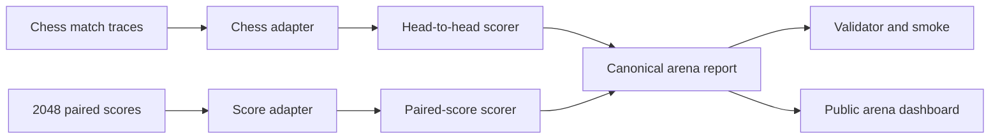

# Design: Extensible game arena

## Decision

Use one canonical arena report whose games declare their competition family.
Adapters normalize existing evidence; scorers remain family-specific.

## Canonical competition families

### Head-to-head

Every match names two policy IDs, colors/roles, a result, termination, and a
source trace. The scorer fits a regularized Bradley-Terry model on all valid
win/draw/loss observations and centers the connected pool at 1500. A seeded
match-level bootstrap produces a 95% interval. Ratings are explicitly
`provisional` until the config's minimum total games, minimum games per rated
policy, connectivity, color-balance, and unacceptable-forfeit gates pass.

The number is **Arena Elo** for this protocol. It is not FIDE, human, engine,
Lichess, or Chess.com Elo. Tactical exact-move accuracy remains separate.

### Paired score

Every trial names a policy, a baseline, a shared seed/instance ID, both scores,
and source evidence. The scorer reports means, paired delta, paired win rate,
and a seeded bootstrap interval. It never emits Elo because opponents do not
interact in the same episode.

## Failure and legality semantics

- A completed head-to-head illegal-decision forfeit remains a game result and
  is counted separately.
- Provider failures, interrupted games, missing opponents, duplicate match IDs,
  and malformed outcomes fail validation or remain explicitly incomplete.
- The arena never repairs a move, invents a missing game, or converts a puzzle
  score into a match result.
- Qualification thresholds are frozen in config and reported independently
  from numerical ratings.

## Extension boundary

Each adapter supplies:

1. `game_id` and competition family;
2. normalized participants and observations;
3. source artifact paths and trace hashes where available;
4. game-specific metadata that does not affect the generic scorer.

Adding a game does not modify Elo math or the report schema. A new competition
family requires a new versioned scorer and OpenSpec change.

## Trial interpretation

The existing four Qwen chess games exercise the Elo path but cannot qualify:
two outcomes are notation forfeits and the cohort is far below the minimum.
The report may show a provisional diagnostic rating and wide uncertainty while
the UI labels both policies `unrated`. Existing Sonnet and Opus 2048 evidence
exercises the paired-score path and keeps the failed capability-gradient
decision visible.

## UI direction

Preserve the benchmark archive's dark evidence instrument. The first viewport
shows the rating pool as a horizontal field rather than a generic card grid.
Visitors switch games, see the appropriate rating vocabulary, inspect evidence
quality before rank, and follow through to the existing replay pages.
