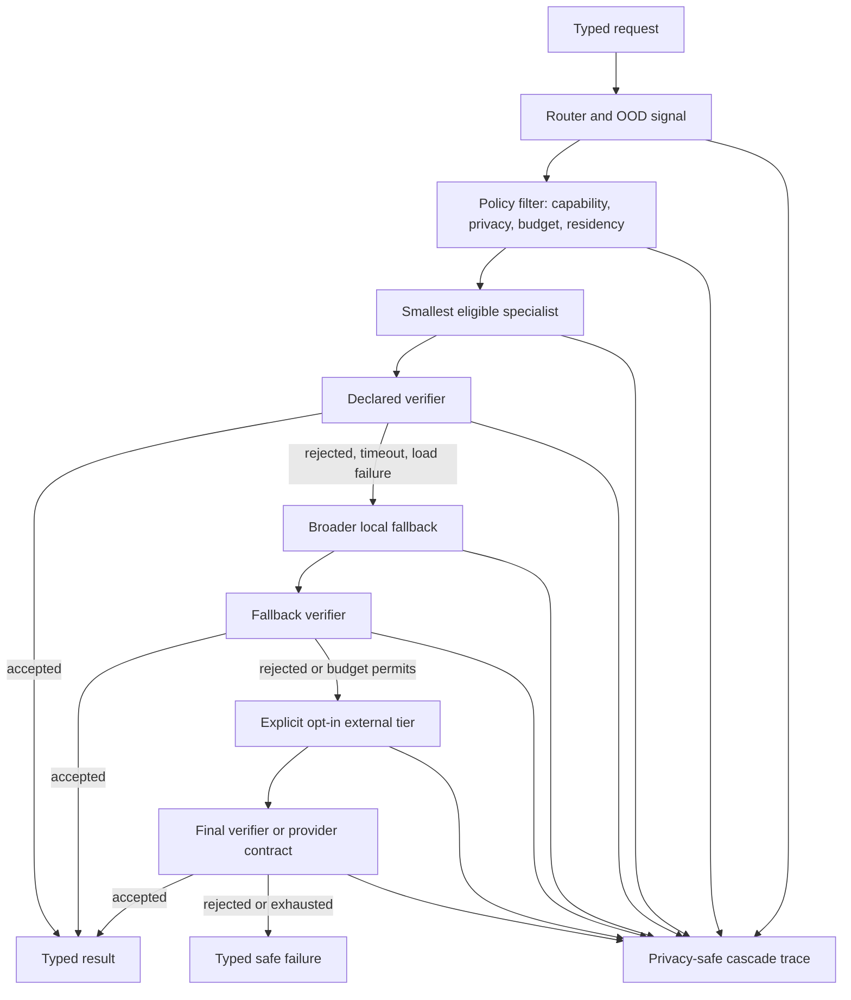

## Context

The current registry answers “what specialist packages exist?” It does not
answer “which node is eligible for this request, how is its output accepted,
what happens on uncertainty or failure, and what did the complete path cost?”

Existing B2/B7 and B5 plans deliberately stop before production
multi-specialist and multi-tier routing. This change supplies that downstream
system contract while leaving their model/data experiments independent.

## Goals / Non-Goals

**Goals:**

- Add a capability graph without breaking flat-registry consumers.
- Route to the smallest eligible measured specialist under policy.
- Require verification or an explicit deterministic acceptance rule.
- Escalate through bounded local tiers and an opt-in external tier.
- Return a typed safe failure when no result is accepted.
- Account for route, load, verification, retry, residency, and cost.
- Produce traces consumable by the Everyday Specialist Benchmark.
- Verify infrastructure with mock nodes before live model loading.

**Non-Goals:**

- Training B2/B7 routers or the B5 learned deferral signal.
- Token-level MoE, weight merging, or adapter composition algorithms.
- Parallel decomposition, debate, or multi-leaf execution in V1.
- Automatic model acquisition/removal, provider credentials, deploy, or Pace
  production integration.

## Architecture



## Decisions

### Add a graph beside the registry

`specialists/registry.json` remains package identity, artifact, model-card,
eval-report, and lock authority. A new `specialists/capability-graph.json`
references package ids and owns runtime relationships, policies, and verifier
bindings. Copying package evidence into a v2 registry was rejected because it
would break consumers and create two sources for artifact truth.

### Represent a graph but execute one bounded fallback chain in V1

Everyday tasks can cross domains, so the schema allows `composes-with` metadata
and shared parents. V1 executes exactly one selected leaf followed by ordered
`fallback-to` edges. `composes-with` is descriptive and ignored by execution.
This keeps failure semantics and resource accounting understandable before
parallel decomposition exists.

### Require typed nodes and edges

Node kinds are `router`, `specialist`, `generalist`, `verifier`, and
`external-fallback`. Executable edge kinds are `routes-to`, `fallback-to`, and
`verified-by`; `composes-with` is non-executable in V1. Every edge is checked
for compatible capabilities and request/response schemas.

### Prefer the smallest eligible node within a quality floor

Policy first removes nodes that are uninstalled, incompatible, outside their
measured operating envelope, disallowed by privacy/network settings, or over a
hard resource budget. Selection then prefers the lowest measured active/resource
cost that meets the configured quality floor. Residency may break ties or apply
only within an explicit quality tolerance; it cannot silently lower the floor.

### Never accept a generative result on self-confidence alone

An acceptance policy references structural, executable/final-state, or
separately calibrated learned verifiers. Model confidence may affect selection
or trigger escalation, but a generative node cannot be its sole judge. An
LLM-as-judge signal is advisory unless the task explicitly classifies it as a
versioned calibrated verifier with held-out selective-risk evidence.

### Bound every cascade

Policies declare maximum hops, wall time, resident bytes, energy when
available, and external cost/call count. Timeout, load failure, verifier
rejection, route uncertainty, and policy refusal are typed escalation reasons.
Exhaustion returns a typed safe failure and never returns the last rejected
answer.

### Make external fallback opt-in and credential-free in graph data

An `external-fallback` node describes a provider/runtime alias and privacy class
but contains no credential or secret. The execution policy must explicitly
allow network/external use, and existing runtime credential boundaries resolve
authorization outside the graph. Dry-run shows the boundary without calling it.

### Trace metadata by default, content only by explicit policy

Traces include graph/policy hashes, capability/schema metadata, candidates,
filter reasons, selected node, route confidence, load state, verifier outcome,
escalation reason, resource/cost evidence, and terminal outcome. Request text,
tool results, and outputs are redacted by default. Public receipts use hashes
and aggregates.

### Separate installed, resident, and active size

Each attempt records active parameters, model/adaptor bytes loaded for that
request, peak resident bytes, and total installed artifact bytes. Shared-base
and adapter bytes are distinct. Cold and warm end-to-end latency include route,
load, verification, and retry; model-only timing is optional supplementary data.

## Proposed artifacts

Exact source filenames may follow Swift package conventions during apply, but
the intended boundaries are:

```text
configs/specialist-capability-graph.schema.json
specialists/capability-graph.json
native-mac/Sources/TinyGPTIO/CapabilityGraph.swift
native-mac/Sources/TinyGPTModel/CapabilityGraphValidator.swift
native-mac/Sources/TinyGPTServe/CascadeExecutor.swift
native-mac/Sources/TinyGPT/CascadeCLI.swift
evals/capability-graph-smoke.sh
tests or Swift test targets for graph/policy/execution fixtures
```

If a dependency-free Python or shell validator is materially easier for CI, it
may complement the typed Swift boundary; the schema and fixtures remain shared
truth.

## Development graph

The checked-in development graph should reference existing real package ids
without upgrading their evidence:

- `pace-intent-router-v8` as a router node;
- `qwen3-4b-file-ops-distilled` and/or `qwen3-4b-rest-fused` as specialist
  nodes within their documented envelopes;
- a broader local runtime placeholder with `missing` or measured evidence as
  appropriate;
- deterministic mock verifiers for no-model execution tests;
- an external fallback node disabled by default.

The fixture demonstrates relationships, not a new ship or quality claim.

## Failure model

Typed failure classes include:

- `route-low-confidence` / `route-out-of-distribution`;
- `node-not-installed` / `node-load-failed`;
- `node-timeout` / `node-output-invalid`;
- `verifier-rejected` / `verifier-unavailable`;
- `privacy-policy-blocked` / `network-not-authorized`;
- `hop-budget-exhausted` / `latency-budget-exhausted` /
  `resource-budget-exhausted` / `external-cost-budget-exhausted`;
- `no-eligible-node` / `no-accepted-result`.

Failure summaries are bounded and privacy-safe. Raw local diagnostics may be
stored separately under existing local-output conventions.

## Benchmark integration

The executor exposes a system adapter that returns final task output plus a
validated trace. The Everyday Specialist Benchmark computes final task success,
false accepts, route regret, escalation precision/recall, hop/tier distribution,
and complete resource evidence. The graph cannot declare itself successful
based only on per-node evals.

## Risks / Trade-offs

- **Router becomes a new single point of failure** → Measure route regret and
  OOD behavior; allow policy bypass to a broader node on low confidence.
- **Verifier is as weak as the generator** → Prefer deterministic/final-state
  checks and separately version learned verifiers with held-out risk curves.
- **Cascade latency exceeds one generalist call** → Include cold/warm full-path
  latency and compare against single-model baselines; cap hops and prefetch only
  after measurement.
- **Thousands of artifacts exceed disk/RAM** → Distinguish installed/resident/
  active size, use bounded LRU residency, and allow shared-base adapters.
- **Graph becomes configuration sprawl** → Keep package identity in the flat
  registry, validate all references, and keep V1 execution to one chain.
- **A rejected result leaks through on exhaustion** → Make accepted result and
  typed safe failure disjoint terminal types and test the boundary.

## Migration Plan

1. Add schema, validator, fixtures, and graph inspection without runtime use.
2. Add deterministic dry-run selection and policy filtering.
3. Add mock cascade execution and verifier/fallback tests.
4. Add privacy-safe tracing and benchmark adapter.
5. Qualify live loading only under separately approved lightweight runs.
6. Production-app integration, if ever selected, requires its own scoped plan.

Rollback removes the additive graph and executor surfaces; flat registry and
all existing package/runtime behavior remain intact.

## Open Questions

- Whether the graph executor belongs in `TinyGPTServe` or a new small runtime
  target. Decide from dependency boundaries during implementation; keep schema
  and validation in pure IO/model layers.
- Whether V1 should prefetch the first fallback after route selection.
  Recommendation: no; first measure cold-load contribution and only prefetch if
  the benchmark proves a latency win within the memory budget.
