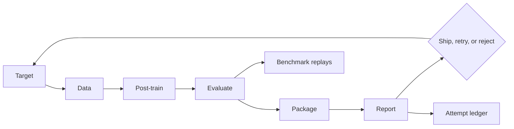

# Design: Specialist factory walkthrough

## Decision

Build one server-rendered editorial index over the evidence that already
exists. The walkthrough explains the loop; canonical docs and source remain the
authority.

## Information architecture

The page has four layers:

1. A short thesis and the complete factory loop.
2. Six numbered chapters, each answering one practical question.
3. Case files showing that improvement, regression, and failed rulers all
   produce useful decisions.
4. An annotated source index that maps the narrative back to code.

The page links out rather than copying long documentation. This keeps the
walkthrough readable and prevents a second source of truth.

## Evidence semantics

- A result is shown only when it already exists in `PROJECT_STATUS.md`, a
  canonical report, or a public benchmark artifact.
- Every case file has an explicit state such as `shipped`, `routed`, `rejected`,
  or `candidate`.
- Candidate chess evidence and the failed Character 2048 ruler remain visibly
  unqualified.
- The page never turns development diagnostics into qualified benchmark claims.

## Rendering and indexing

Astro renders the full article into static HTML. The route receives a unique
title, description, canonical URL, Open Graph metadata, and page-specific
`CollectionPage` structured data. Existing build tooling adds the route to the
sitemap, Markdown mirror, and agent catalogs.

## Visual direction

Preserve the dark evidence instrument used by the benchmark archive: deep ink
surfaces, ruled structure, teal live-state accents, coral failures, amber
candidate states, Bricolage display type, Geist body type, and Geist Mono for
identifiers. The chapter rail is the signature composition. It should read like
an annotated lab notebook, not a generic documentation card grid.
