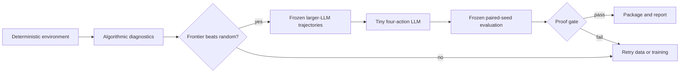

## Context

See [proposal.md](proposal.md) for motivation. The repository already has an
abstract game-RL skeleton in `scripts/archive/game_rl_poc.py`, but its
environment and rollout methods are unimplemented and its intended target is a
larger Fleet NPC world. The 2048 experiment is a separate deterministic
micro-environment that de-risks the same environment/reward/policy loop without
requiring game integration or an LLM judge.

The active repository sequence is
`target -> data -> post-training -> eval -> package -> report`. This change
implements and qualifies the target/eval boundary first. Model training and
long seed sweeps remain subject to the repository's explicit owner-approval
rule.

## Goals / Non-Goals

**Goals:**

- Make every transition and aggregate result reproducible across processes.
- Establish cheap algorithmic diagnostics before evaluating language models.
- Freeze larger general LLMs as capability anchors and possible trajectory
  sources for a later 30–50M four-action specialist.
- Produce leakage-safe state/action trajectories suitable for that specialist.
- Measure the quality/latency trade-off on paired game seeds.
- Keep the V0 environment and smoke suite dependency-free and CPU-only.

**Non-Goals:**

- GUI play, screenshots, browser automation, or the Fleet NPC environment.
- Claiming 2048 is an Everyday Specialist Benchmark task.
- Training, GRPO, long benchmark sweeps, packaging, or publishing in the first
  implementation slice.
- Replacing `scripts/archive/game_rl_poc.py` before this smaller environment is
  qualified.

## Decisions

### 1. Use a standalone Python reference environment

Implement the reference under `scripts/game_2048.py`, with small frozen configs
under `configs/game-2048/`, tests under `tests/`, and a no-model smoke wrapper
under `evals/`.

Python's standard library is sufficient for a 4-by-4 integer board and keeps the
correctness oracle readable. Gymnasium or another game package would add a
dependency without improving V0 correctness. A faster implementation may be
added only after it proves transition parity with this reference.

### 2. Own the random stream

Use a small pinned integer PRNG such as SplitMix64 rather than Python's ambient
`random` state. Environment spawning and any random-policy choice use separate
derived streams so an agent's internal randomness cannot perturb tile spawning.
Reset places two tiles. Each legal state-changing move then chooses one empty
cell uniformly and spawns `2` with 90% probability or `4` with 10% probability.

Invalid/no-op actions do not advance the environment stream. During scored
episodes they are recorded as a policy failure and terminate that episode; this
prevents an adapter from receiving free retries while preserving the untouched
state for diagnosis.

### 3. Freeze a compact observation/action protocol

The canonical model input is text, not an image. Its frozen character grammar is
`B=<16 cells>;S=<score>;M=<moves>;L=<legal actions>`. Each row-major board cell
is one base-36 tile-exponent character: `0` is empty, `1` is tile 2, `2` is tile
4, through `b` for tile 2048. Legal actions use `U`, `D`, `L`, and `R`; model
output is exactly one of those characters. Both model adapters use the same
serializer and parser revision. No screenshot, vision encoder, OCR, or learned
visual front end participates.

The Python policy boundary is conceptually:

```text
choose(observation, legal_actions) -> action
```

A later command/model adapter will consume that exact character representation.
The evaluator records the candidate's raw action and never silently replaces an
illegal action. Every model has a strict raw-action track. A separate diagnostic
track may constrain the next-token distribution to the currently legal action
characters; it measures planning among legal choices and never overwrites the
strict compliance-plus-planning result.

### 4. Qualify algorithmic diagnostics in increasing cost order

The initial cohort contains:

1. `random-legal`: a seeded floor and RNG sanity check.
2. `greedy-one-ply`: simulate every legal move without spawning and rank by a
   fixed combination of immediate merge score, empty cells, monotonicity, and
   maximum-tile corner preference.
3. `expectimax-bounded`: a pinned depth/budget search over legal moves and 2/4
   chance nodes, used only to diagnose environment quality and contextualize
   scores.

These policies may verify the engine, rewards, and harness, but they SHALL NOT
provide training actions, define the proof gate, appear as the headline
opponent, or be described as the capability ceiling. If an algorithm can solve
the game better than an LLM, that says nothing about whether specialization
compressed language-model capability.

### 5. Separate seed namespaces and state identities

Configs declare disjoint development, trajectory-training, algorithmic
diagnostic, and frozen-evaluation seed namespaces. Generated examples carry
their source seed, step, larger-model identity, prompt/adapter revision, and a
canonical board hash. Validation fails on a seed or exact board-state collision
across train and evaluation splits.

The frozen suite is never used for training, curriculum selection, search
weight tuning, or acceptance-threshold calibration.

### 6. Use canonical traces as the verifier

Each transition is written as deterministic, key-sorted JSON. A complete game
has a SHA-256 trace hash covering environment revision, config, seed, every
pre-state/action/post-state/reward record, and terminal reason. The episode
reward is the standard merge-score delta, whose sum must equal final game
score.

This provides a programmatic RLVR reward and reproducible evidence without an
LLM judge.

### 7. Freeze fair larger-LLM opponents

The capability comparison is a 30–50M specialist LLM versus larger general
LLMs, with 50,000,000 parameters as a hard candidate ceiling. Before generating
data, freeze each larger model name and immutable
revision, prompt, character-board serializer, action parser, decoding settings, context
policy, and per-move limit. Both models receive the same visible board and legal
actions and return one action. Neither may call tools, execute code, search,
perform rollouts/lookahead, inspect hidden RNG state, or use an algorithmic
policy to select its move.

Mutable cloud aliases may be used for development smoke tests, but never as
frozen evidence until the provider-resolved model revision is recorded.
Larger-LLM trajectories may supervise the specialist, but only from the
training namespace. Algorithmic policies never supply labels. The frozen
evaluation namespace remains unseen by both trajectory generation and tuning.

### 8. Compare on paired seeds and report both quality and cost

The runner evaluates every entry on the same seed list and preserves per-seed
results. Aggregation reports mean, median, p25/p75, maximum-tile distribution,
2048 reach rate, invalid decisions, episode length, paired score delta, paired
win rate, p50/p95 decision latency, decisions per second, load time, and total
wall time. A deterministically seeded paired bootstrap supplies uncertainty for
score deltas.

The first learned proof requires a specialist of at most 50,000,000 parameters,
zero invalid decisions on the strict track, a positive paired mean score delta
over the larger LLM, a paired win
rate above 50%, and a positive lower bound on the paired score-delta confidence
interval. Parameter count, model bytes, RAM, load time, latency, throughput, and
cost are reported for both models. Algorithmic results remain diagnostic and do
not affect pass/fail.

### 9. Stage the factory loop behind explicit gates



The frontier-admission gate prevents a meaningless specialist run: at least one
pinned cloud frontier must make zero strict-track invalid decisions and beat
`random-legal` on the constrained paired suite with a positive uncertainty
lower bound, at least a 60% paired win rate, and at least a 1.10x mean-score
ratio across 30 seeds. The first apply slice stops after environment and lightweight baseline
qualification. Trajectory generation, any sustained baseline suite, training,
and post-training evaluation require the owner-approved next slice. ReST/GRPO
is a later improvement method, not part of environment qualification.

## Risks / Trade-offs

- **[Algorithmic search dominates both LLMs]** -> Keep it diagnostic-only; the
  claim is language-model specialization, not global 2048 optimality.
- **[Larger LLM uses hidden agentic advantages]** -> Freeze identical visible
  inputs and deny both models tools, code, search, rollout, and hidden state.
- **[Seed overfitting]** -> Use disjoint namespaces, board-hash leakage checks,
  and a frozen held-out suite.
- **[Heuristic weights become another hidden benchmark]** -> Version all
  weights/configs and prohibit tuning on frozen seeds.
- **[Stochastic games obscure comparisons]** -> Use paired seeds, retain
  per-game outcomes, and report uncertainty rather than a single best run.
- **[A policy masks illegal preferences]** -> Record adapter policy and raw
  legality behavior; never let the harness silently repair actions.
- **[Benchmark or training stresses the host]** -> Keep CI to tiny fixtures and
  require explicit approval for sustained seed sweeps or model work.
- **[2048 distracts from the active Pace lane]** -> Keep V0 CPU-only and bounded;
  it runs as an independent factory target, not a new product surface.

## Migration Plan

This is additive and has no runtime migration. If V0 is rejected, remove the
new environment/config/test surfaces and retain the OpenSpec/attempt evidence;
no existing model, run schema, or production path changes.
