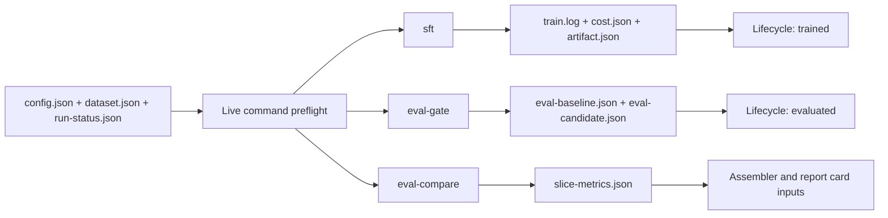

## Context

`scripts/assemble_factory_run.py` already turns validated fragments into a
canonical report. `FactoryRunLifecycle` already enforces ordered, atomic state
transitions. The missing connection is at the command boundary: `sft` writes an
adapter, `eval-gate` writes its own gate report, and `eval-compare` prints a
view, but none records the corresponding canonical run evidence.

## Goals / Non-Goals

**Goals:**

- Make measured training and evaluation evidence land in the selected run
  folder without hand translation.
- Fail before model work when the run identity or lifecycle phase is invalid.
- Advance lifecycle state only after durable, typed evidence exists.
- Keep all no-model and pre-existing CLI paths lightweight and compatible.

**Non-Goals:**

- Creating a target, dataset manifest, or evaluation contract from heuristics.
- Automatically deciding, assembling, packaging, publishing, or deploying.
- Retrofitting every training/evaluation command in this slice.
- Running a GPU verification without separate owner approval.

## Architecture

## Decisions

### Keep frozen context operator-authored

`--factory-run` points at an existing lifecycle-managed directory. The command
validates `config.json`, `dataset.json`, and `run-status.json`; it does not
create them. A live command cannot reliably infer the owner goal, regression
suite, held-out split, or leakage policy from model arguments.

### Put persistence in TinyGPTIO

A model-free `FactoryRunEvidence` helper owns typed fragment encoding, atomic
replacement, phase preconditions, and lifecycle advancement. Command files
only translate their already-computed outputs into typed evidence. This keeps
the durable boundary independently testable without MLX.

### Make lifecycle ownership explicit

`sft --factory-run` requires `data-ready`, transitions to `training` before
model work, and reaches `trained` only after the adapter and training evidence
exist. A terminated process may leave the honest `training` state for explicit
reconciliation; it must not fabricate a successful transition.

`eval-gate --factory-run` requires `trained`, transitions to `evaluating`
before the gate, and reaches `evaluated` only after both canonical eval
fragments validate. `eval-compare` writes derived slice evidence but does not
advance lifecycle state because rendering a comparison is not proof that the
declared gate completed.

### Select the primary suite from frozen config

`eval-gate` uses `config.eval.primary` to select exactly one suite from its
report. Missing or ambiguous matches fail closed. Baseline and candidate model
identities come from the frozen config and candidate E0 rows respectively;
the recorded command is bounded CLI provenance, not raw output.

### Derive slices deterministically from E0 rows

`eval-compare` groups rows by task, optional subtask, and metric, then records
baseline/candidate means, row counts, delta, and a pass flag when both sides
exist. It rejects conflicting metrics or more than one candidate model instead
of silently mixing incomparable evidence.

## Risks / Trade-offs

- **An interrupted command leaves an active phase** → Preserve the last honest
  state; existing lifecycle status/reconcile tooling makes the interruption
  visible for explicit operator action.
- **A primary suite name does not match report rows** → Fail without writing
  canonical eval fragments or advancing to `evaluated`.
- **Command arguments expose private payloads** → Record a bounded command
  shape and paths only; never persist prompts, completions, row content, or
  environment variables.
- **Partial multi-file writes occur** → Validate all payloads before atomic
  replacement and advance lifecycle only after every required file exists.

## Migration Plan

The flags are additive. Existing invocations behave exactly as before. A new
run opts in by preparing canonical config/dataset files, initializing the
lifecycle, and passing `--factory-run`. Rollback removes the flags and helper;
existing fragments and lifecycle files remain readable.
