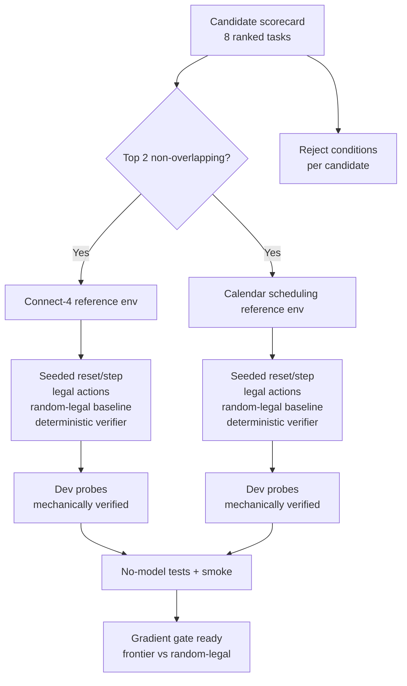

## Context

AGENTS.md establishes the frontier-ceiling gate: before any benchmark grades
Mac models, a frontier model must score ~100% on it. If frontier can't ace
it, the benchmark is broken. This change applies the same principle one
level earlier: before any specialist training, the benchmark task itself must
show that a pinned frontier LLM materially beats a valid random/legal
executor. Without that gradient, specialist training has no signal to
optimize.

The existing `add-everyday-specialist-benchmark` change defines a cohort
comparison framework (generalists vs adapted vs systems on everyday tasks).
This lab is complementary but distinct: it ranks *which tasks* can show a
capability gradient at all, implements reference environments for the best
two, and provides the harness to run the gate. Qualified tasks may later be
promoted into the everyday benchmark as additional families.

The specialist hard ceiling is 50M parameters (intended band 30-50M). This is
smaller than T5-small (~60M). Tasks must be expressible as compact text
in/out sequences that a model of this size can learn. Character-only 2048 is
the baseline candidate but is at risk: random legal play already reaches
512-1024, and frontier text-mode play struggles with long-horizon spatial
strategy over hundreds of moves.

## Goals / Non-Goals

**Goals:**

- Rank six-plus deterministic text-only candidate tasks with full protocols,
  metrics, verifiers, leakage plans, fit estimates, costs, and reject
  conditions.
- Implement dependency-free Python reference environments for the best two
  non-overlapping candidates.
- Provide a random-legal baseline executor for each environment so the
  gradient gate can be measured.
- Add mechanically-verifiable development probes with provenance.
- Verify all infrastructure with no-model tests before any frontier run.

**Non-Goals:**

- Running frontier models, cloud APIs, training, or long benchmarks.
- Creating specialist training labels or frozen evaluation material.
- Replacing the everyday-specialist-benchmark cohort framework.
- Implementing all eight candidates — only the top two get reference envs.
- Algorithmic optimal solvers as headline opponents (random-legal is the
  baseline; algorithmic policies may validate an environment but are not the
  headline opponent or specialist label source).

## Architecture

## Decisions

### Rank by gradient likelihood, not just difficulty

The first gate is: how likely is this task to show
`valid executor score << frontier score`? The separate headline gate is
whether a no-more-than-50M specialist can materially beat that same larger
LLM. The scorecard must label evidence for both questions; learnability alone
cannot stand in for specialist superiority.

### Select non-overlapping capabilities

The two implemented candidates must test different reasoning modes so a
specialist trained on one does not trivially transfer to the other, and so
the gradient gate covers two distinct capability axes. Connect-4 tests
tactical lookahead on a fixed spatial board; calendar scheduling tests
temporal constraint satisfaction with variable inputs.

### Random-legal is the baseline, not optimal

For games, the gradient gate compares frontier to a random legal executor. For
single-turn everyday tasks, the random executor emits a well-formed in-range
action while semantic constraint satisfaction determines success. This is the
weakest non-trivial baseline without secretly sampling the answer set. If
frontier cannot beat it materially, the task has no reasoning signal. An
algorithmic optimal solver may validate the
environment (e.g., a minimax solver confirms the verifier accepts correct
play) but is never the headline opponent or the specialist label source.

### Character/text input only

Models see only text state representations and output text actions. No
screenshots, vision, OCR, browser automation, tools, search, code execution,
hidden state, or algorithmic solver is available to evaluated models. The
environment owns all state transitions and verification.

### Procedural generation with sealed seeds for leakage control

Each environment generates instances from a seeded RNG. Training and
evaluation use disjoint seed ranges. Development probes are public and
explicitly marked as not held-out. Frozen evaluation material does not exist
yet and will be created in a separate change only after the gradient gate
passes.

### Dev probes are mechanically verified and development-only

Devin-authored, GLM-assisted development probes are included only if every item can be
verified by the environment's own deterministic verifier. They carry
provenance metadata, are marked development-only, and create no specialist
training labels. They exist to exercise the verifier and harness, not to
serve as evaluation data.

## Candidate Ranking Summary

| Rank | Candidate | Type | Baseline evidence | Public role |
|------|-----------|------|-------------------|-------------|
| 1 | Calendar scheduling | everyday | random valid 28.05%, 2,000 seeds | frontier-gradient candidate |
| 2 | Connect-4 | game | random X win 54.75%, 2,000 seeds | internal calibration only |
| 3 | Mastermind | game | unverified projection | unimplemented |
| 4 | Sokoban-small | game | unverified projection | unimplemented |
| 5 | 2048 | game | failed separate frontier screen | rejected current form |
| 6 | Task-dependency-ordering | everyday | unverified projection | unimplemented |
| 7 | Maze-nav-small | game | unverified projection | unimplemented |
| 8 | Minesweeper-small | game | unverified projection | unimplemented |

Full per-candidate details (protocol, metric, verifier, leakage, cost, reject
condition) live in the machine-readable scorecard at
`configs/capability-gradient-lab/candidates-v1.json`.

## Risks / Trade-offs

- **Connect-4 saturates** — random first-player performance is 54.75%, the
  game is solved, and shallow tactics can erase the useful skill signal.
  Mitigation: retain it only for internal harness calibration.
- **Calendar frontier gradient is not yet measured** — random well-formed
  proposals now succeed 28.05%, but no frontier was called. Mitigation: run a
  small pinned frontier screen before freezing anything.
- **30-50M specialist superiority is only a hypothesis** — passing frontier
  versus random is necessary but insufficient. Mitigation: keep public
  admission blocked until the specialist beats the same larger LLM.
- **Dev probes could leak into training** — mitigated by explicit
  development-only marking, provenance, and the rule that no frozen eval
  material exists yet.

## Migration Plan

This is additive. No existing files migrate. Rollback removes the new config
directory, script, probes, tests, and smoke without changing any existing
surface.
