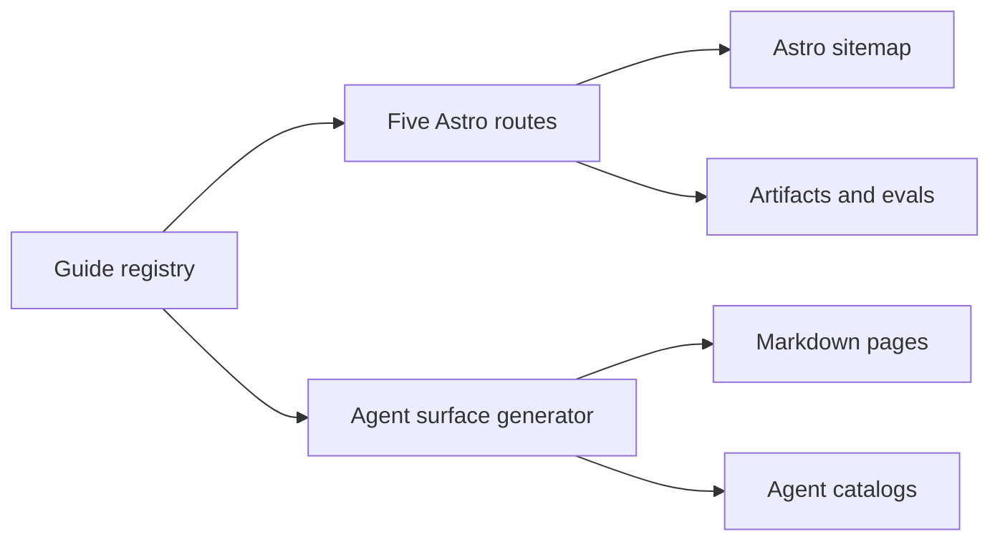

# Context

The public browser site already has a distinct dark research-lab visual language and a post-build agent-surface generator. The active checkout contains unrelated work, so implementation occurs in an isolated worktree at current `origin/main`.

# Approach

Create a typed guide registry and a shared Read-mode Astro layout. Explicit route files select entries from the registry. Extend the existing agent-surface generator so the same source emits Markdown and catalog records.

# Decisions

- Preserve the current lab-console identity and typography.
- Keep pages static and dependency-free.
- Mark all historical, missing, synthetic, routed, or unqualified evidence explicitly.
- Source external MLX statements only from official MLX LM documentation.
- Do not expose private runs, training data, prompts, checkpoints, or local artifacts.

# Validation

Strict OpenSpec validation, browser production build, agent-surface check, targeted canonical/schema/sitemap/link assertions, manual detector, and browser evidence at 390, 768, and 1440 pixels.
