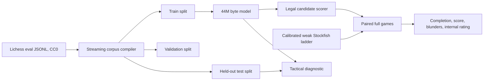

# Design: 50M-parameter Character Chess specialist

## Decision

Adopt the external project's data and full-game evaluation ideas while replacing
its 8B LoRA base with an owned character model inside the 50M ceiling.

## Reproducibility boundary

The external implementation is evidence for a recipe, not a directly portable
artifact. Its Qwen3-8B base, hosted LoRA training, private run state, and large
corpora remain outside this repository. We adopt only independently
reimplementable ideas and cite their provenance. “30M rows” and “30M
parameters” SHALL never be conflated.

Its current public result also combines two distinct improvements: the model's
always-score legal argmax policy and deterministic one-ply finishing guards.
We reproduce both but never merge their evidence. The raw track measures the
weights; the guarded track measures the shipped system.

## Data compiler

The compiler reads decompressed Lichess evaluation JSONL from a file or stdin;
it does not add a zstd dependency. Each row:

1. expands the four-field Lichess FEN to a canonical six-field FEN;
2. chooses the highest-depth evaluation and its first principal variation;
3. verifies the first UCI move is legal;
4. applies frozen minimum-depth and node-count filters;
5. assigns train, validation, or test from a seeded SHA-256 bucket of the
   canonical FEN;
6. writes a character observation, target move, source evidence, and row hash.

The output manifest records source URL, source snapshot/checksum state, license,
filter config, accepted/rejected counts, split counts, and output hashes.
Different splits cannot share a normalized FEN.

## Candidate architecture

Use a byte vocabulary so every FEN, delimiter, legal move, and UCI output has a
stable owned representation. The first candidate is 14 layers, width 512,
8 heads, MLP width 2048, context 512, tied embeddings: exactly 44,527,616
parameters under the repository's canonical estimator. This is a candidate
configuration, not evidence that it can learn chess.

## Legal action selection

Strict generation remains a protocol diagnostic. The training prompt contains
the compact FEN and ply but does not spend the 512-byte context copying a legal
move list. The primary full-game policy obtains that list from python-chess,
scores only those UCI continuations (including the terminating newline), and
executes the highest-scoring candidate after a final membership check. This is environmental
constraint selection, not an engine hint: Stockfish scores are unavailable to
the candidate at inference.

## Finishing guards

The optional guarded policy independently reimplements three public one-ply
rules over the model's already-scored legal candidates:

1. if any legal candidate checkmates immediately, rank only mating moves;
2. otherwise, exclude moves that allow opponent mate-in-one when a safe
   alternative exists;
3. in a clearly won position, exclude moves that immediately draw or hand over
   a claimable draw when a safe non-drawing alternative exists.

"Clearly won" uses only board facts: mate-in-one, at least four pawns of
material advantage, or a non-losing side constraining the opponent to at most
two legal replies. The guard uses no Stockfish, book, or search. Every
intervention, reason, candidate count, and selected move is recorded. A guarded
rating is a different policy rating and cannot be quoted as raw model strength.

## Move-quality diagnostics

An offline Stockfish referee grades the moves already present in archived game
traces. From the mover's perspective it compares the played move with
Stockfish's best at a pinned limit, maps mates to a disclosed finite score, and
reports average centipawn loss plus rates at 100 cp and 300 cp. This referee is
evaluation-only and is never available to either raw or guarded candidate
selection.

## Staged data composition

The 44M experiment uses learning-curve gates rather than jumping from eight
memorized rows to a multi-million-row claim. Frozen stages are 10k correctness,
100k signal, 1M scale, and 2M reproduction. Each stage declares exact source
fractions for general Stockfish-labelled positions, verified endgames, and an
optional eight-percent grounded-commentary arm. Commentary enters only with a
compatible license, Stockfish-grounded move, and a terse-only control arm; it
is an ablation, not an assumed improvement.

## Opponent ladder

The ladder uses Stockfish 18 with one thread and pinned limits. Its lower rungs
mix a weak, node-limited Skill-0 move with a seeded random legal move at frozen
probabilities. A UCI-limited 1320 engine is the calibration anchor. Candidate
matches use paired colors and a frozen opening set.

Internal ladder ratings require a connected pool, a disclosed anchor, at least
30 completed games per candidate, balanced colors, and no more than 10%
invalid-decision forfeits. Before those gates pass, reports say `unrated` and
may expose only diagnostic estimates with uncertainty.

Even after those gates pass, a candidate outside the calibrated opponent range
is reported as `<lowest rung` or `>highest rung`. A fitted number beyond the
range may be retained only as a clearly labeled diagnostic extrapolation.

## Heavy-work boundary

Tiny fixture compilation and one or two engine smoke games are allowed. Large
downloads, million-row compilation, model training, and match sweeps remain
operator-gated and must hold the repository's GPU/workload guardrails.
