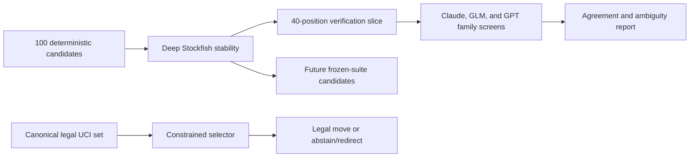

# Design: frozen Chess benchmark candidate suite

## Decision

Separate four questions that were conflated in the first development screen:

1. Stockfish stability decides whether a label is technically admissible.
2. Model agreement highlights legibility and ambiguity but never overrules the
   engine oracle.
3. Exact-move agreement measures tactical selection.
4. Legal-action selection guarantees that an executed move is legal without
   hiding how often the unconstrained policy would have failed.

## Candidate and label contract

Generate 100 non-duplicate positions from deterministic shallow Stockfish play
with injected non-best moves. Provisional generation may use the existing fast
depths, but final candidate labels are recomputed by Stockfish 18 at depth 20
with MultiPV 3. A position is stable only when:

- its depth-16 and depth-20 top UCI move agree;
- the depth-20 best-vs-second gap is at least 150 centipawns, or the best line
  is a forced mate and the second line is not an equivalent mate;
- every recorded principal-variation move is legal from its preceding state;
- the normalized FEN is unique across the candidate pool and the original
  development suite.

The fixture records both search depths, scores, MultiPV alternatives, engine
identity, binary identity, generation seed, and trace hash. A deeper label may
change the original depth-12 answer; the old artifact remains untouched.

## Multi-model verification slice

Select 40 candidates deterministically after engine verification, stratified
across legal-move count and engine gap. Every model sees the identical
characterwise FEN/PLY/LEGAL observation. Record requested and resolved model
identity, backend version, decoding/effort, output, latency, usage/cost when
available, and failure state.

Codex `gpt-5.5` remains the development anchor. Lower GPT aliases are probed
before the screen; unavailable aliases become explicit attempt artifacts rather
than silently falling back. Claude is secondary independent-family evidence
because `claude -p` is an agent CLI, not a clean benchmark endpoint. It runs in
safe/no-tools/no-session mode and cannot establish the frontier ceiling alone.
Free Devin GLM-5.2 receives all observations in one sealed batch prompt. Its
raw response is validated against each legal set; because Devin does not expose
per-position enum-constrained decoding, invalid rows abstain or redirect rather
than being silently repaired.

## Legal-action selection

The canonical action space is the sorted legal-UCI list produced by
`python-chess`.

- Cloud structured-output adapters use a per-position JSON Schema enum.
- A future local specialist masks every non-legal action before argmax or scores
  only supplied legal candidates.
- The executor validates membership again before applying the move.
- Schema failure, timeout, or empty output causes abstention or explicit
  redirection; it never causes an unvalidated move to execute.
- Reports include `raw_legal_rate`, `constraint_intervention_rate`,
  `executed_legal_rate`, `abstention_rate`, and `redirect_rate`.

Constrained accuracy is a valid policy metric because legal moves are part of
the environment action space. Raw strict accuracy remains a diagnostic so the
wrapper cannot be mistaken for model intelligence.

## Stopping rules

Stop and retain evidence if label stability falls below 90%, a backend changes
model identity, structured output admits a non-enum move, provider failures
exceed 10%, or the configured call budget is reached. Do not train the 30–50M
specialist until a later frozen suite has a pinned frontier ceiling near 100%.

## Non-goals

- LLM consensus is not chess ground truth.
- No Elo or full-game strength claim.
- No specialist training, synthetic trajectory generation, deployment, or
  benchmark publication in this change.
